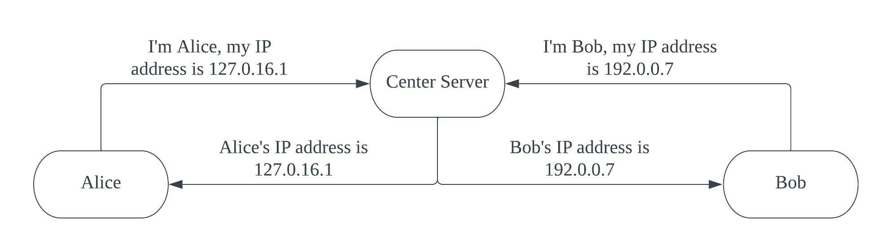
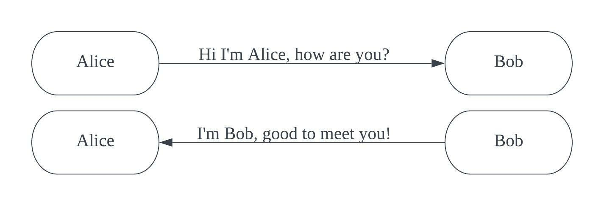

# EC530 P2P Chat Hackathon

## Description
This P2P chat module enables two users communicate with each other in peer-to-peer mode instead of client-server mode. To help users find each other, I used a center server for users to exchange their IP addresses. Once the exchange is done, the center server will be closed, and two users can communicate without going to any third server.

## Architecture

### Phase 1
In phase 1, Alice and Bob exchange their IP addresses through center server. They first connect to center server, and then it will send their IP addresses to respective clients.



### Phase 2
In phase 2, Alice and Bob can directly communicate with each other without connecting to third server.



## Setup

To be able to run the project, you need Python3 installed. You also need 3 hosts.

On each host, first clone the project and change to project folder
```shell
git clone https://github.com/dLuffy19/ec530-p2pchat.git
cd ec530-p2pchat
```

Host 1 is served as center server. In command line, run
```shell
python3 center_server.py
```

Host 2 and host 3 are client Alice and Bob. In command line, run
```shell
python3 client.py
```

Then you are good to go!